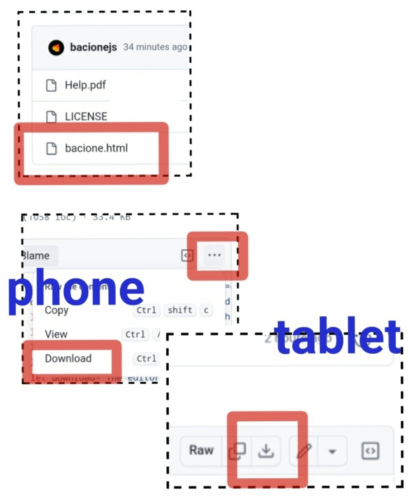

## Brochure

## How To Download

## Links
- [Live](https://bacionejs.github.io/editor):
  - the editor only works with Chrome browser, tablet or phone
  - however, exported games, which remove the editor first, have no limitation
- [Download](#How-To-Download)
  - download bacione.html
  - open your file manager
  - click bacione.html to run in your Chrome browser
  - click Run to play the Ski game
- [Help.pdf](Help.pdf) - same as help inside the editor
- [Games.pdf](Games.pdf) - tutorial for Ski and Marslander
- [YouTube](http://www.youtube.com/@bacionejs) - product demo
- [Reddit](https://www.reddit.com/r/bacionejs) - reddit discussions
- [Github](https://github.com/bacionejs/editor/discussions) - github discussions

### Why Choose This IDE?

Discover the ultimate free IDE code editor designed specifically for programming **small** JavaScript games on your **phone offline**! This phone editor was created because many people don't have a computer, and other phone editors lack important features.

It's also ideal for experienced programmers who sometimes find programming small games on a tablet or phone more **relaxing** than on a laptop or desktop.

Bacione means "big KISS," as in "Keep It Satisfyingly Simple." It offers **less clicks** compared to other phone editors, with common keys accessible in one click and context-aware logic that reduces the need for repetitive actions. Refactoring code is easier, and you have a fully programmable keyboard where you can create your own icons and functions. Designed for phones and tablets, it requires no setup and operates as a single file that's easy to share. Written in plain vanilla JavaScript with no dependencies, it's free (GPL license), contains no ads, and runs directly from your Android file manager in the Chrome browser. The editor itself is only 7 kilobytes, and is easy to modify and customize right within the editor. Plus, it supports swipe and longpress-repeat for enhanced usability.

## Features

- Less clicks compared to other phone editors.
- Common keys are one click.
- Context aware logic reduces clicks.
- Less work to refactor your code.
- Fully programmable keyboard.
- Create your own keyboard icons and functions.
- Designed for phones and tablets.
- No setup required.
- One file.
- Easy to share.
- Offline.
- Plain vanilla JavaScript.
- No dependencies.
- Free (GPL license)
- No ads
- Run from Android file manager in Chrome browser.
- Easy to modify editor.
- Edit the editor in the editor.
- Editor is only 7 kilobytes.
- Supports swipe and longpress-repeat.

## Limitations
- **Compatibility**: The editor only works with the Chrome browser on a tablet or phone. However, exported games, which remove the editor, have no such limitations.
- **Save Mechanism:** The save function in the editor is limited by HTML constraints. As a workaround, a **new** timestamped file is generated each time you save. If you're saving to your Downloads folder, it's important to keep it organized—ideally, free of files from other purposes, as these can accumulate over time. To prevent clutter, it's best to immediately move downloaded files for other purposes into a different folder. A cluttered Downloads folder can make it difficult to quickly locate the most recent timestamped file, which is essential for reopening your work. Also, periodically delete older editor HTML files, keeping only the most recent version.

- **Diff Function:** The Diff function is **naive** and will not produce accurate results. It is designed to provide only an approximate indication of progress since the file was opened or last saved, so use it with caution.

- **Game Size and File Support:** The editor is not designed for large games or multi-file projects. This is because opening an HTML file from the File Manager on Android in the Chrome browser doesn't support multiple files—everything has to be contained within a single, monolithic HTML file. This also means that external images or audio files cannot be used. Programmatically created elements can be utilized instead; for example, the Marslander game uses vector graphics and a noise generator, and several other games utilize emojis.

- **Debugging Limitations:** While the editor includes a debug function that allows you to display variable values and will direct you to the line of code where an error occurs, it lacks more advanced debugging capabilities. Unlike some integrated development environments (IDEs), this editor does not support stepping through code line by line or provide the complex support that a browser console offers. This may make diagnosing and fixing issues more challenging for users.

If this editor doesn't support your needs, you might consider trying Neovim with Termux and Apache. You can find my configuration for those tools [here](https://github.com/bacionejs/termux).

## Issues

- **Keyboard Size**: When opening the editor on a tablet, the keyboard may appear the wrong size. This issue only applies to tablets; on a cell phone, the keyboard width will match the width of the phone. On a tablet, the keyboard should be approximately half the width of the tablet and located in the lower right corner. If the keyboard size appears incorrect, please refresh the page to adjust it to the correct size.
- **Cursor Misalignment**: Swiping up hard at the end of the file in the editor window can cause the cursor to become misaligned with the text. A suggested workaround is to back off a little bit from the end.
- **Frames Per Second (FPS)**: Games that use requestAnimationFrame may not work well in some situations. For example, in the Ski game, on a phone set at 90hz, the game will change speed after a click event. This is because the browser tries to run in 60hz to save battery but will increase hz if it detects more load. A workaround is to set your phone to 60hz.

## Notes
Any reference to **change** below refers to the **Edit-the-Editor** functionality found in the Miscellaneous button, represented by the diamond symbol.

- **Portrait Mode Support**: This editor only supports portrait mode.
- **Themes**: The editor offers both light and dark themes for a customizable viewing experience. You can toggle between themes by swiping up on the Miscellaneous button. You can also **change** or add more.
- **Keyboard Position**: On a tablet, the keyboard should be approximately half the width of the tablet and located in the lower right corner. If you use your left thumb to type instead of your right thumb, you can **change** it.
- **Custom Keyboard Functionality**: This editor is particularly useful because it features a custom keyboard where all the main functionality is accessible with one click. To support this, 22 of the 32 special characters, which are important to programming, are accessible with one click, while the remaining 10 are accessible via the Shift key. Note that the space key is unusually small, located in the bottom right corner. Additionally, the backspace and return keys are on the second row because they coordinate with other keys often. For example, to cut text, you press copy and then backspace, and to unselect, you press the return key. If you don't like this layout, you can **change** it.
- **Formatting**: On a phone, the real estate of the editor is at a premium, and you can't afford a lot of white space, especially horizontal white space. For indentation, you can use the Space key (there is no Tab key), and the Enter key will retain the prior indentation. Try to only use indentation for branches and loops and instead of indenting a function body, use vertical whitespace before and after. See the Marslander game for an example.
- **Comment Button**: The Comment button is very useful for debugging. When you press the Comment button, it comments the code and places a copy in the paste buffer. The next step is to paste that and then edit it. If you don't like the results of the new code, it's easy to delete that and uncomment the original.
- **Navigation**: Navigation is primarily done by touching the screen, so there are no Home, End, or vertical arrow keys. Instead, a left-right arrow is provided to help position the cursor accurately after touching the approximate location. The Zoom key, which increases the text size, can also assist in positioning the cursor in the correct place.
- **Suggested Size**: Since navigating code on a phone can be quite challenging, it's advisable to create games that are small enough to be scrollable with a single gesture.
- **Fullscreen**: Activating fullscreen mode will give you more real estate for navigating and editing your code. You can toggle fullscreen by swiping up on the Zoom button.
- **Closing Views**: There are no close buttons. To close a View, click anywhere or select an option. The Views are: Help, Miscellaneous, Diff and Error.
- **Emoji Generation**: When opening the Miscellaneous View the first time, it will take a moment as the icons are loaded.
- **Pickers**: Color-Picker and Icon-Picker put a code in Paste, so don't be alarmed if it seems nothing has happened. Click the Paste button to see the code.
- **Copying and Pasting**: You must use the internal copy and paste buttons in the editor to copy and paste code within the editor. To copy code from external sources, use system copy and paste techniques, such as long pressing and then choosing copy and paste.
- **Selection**: A major advantage of this editor is efficient selection. The selection is context-based; depending on where the cursor is, it will select a word, a line, a paragraph, or a block of code. To see how selection works, you can watch the [YouTube](http://www.youtube.com/@bacionejs) video. Selection is performed with the Copy button, meaning, two things happen at once. This is mainly to reduce the amount of buttons. Cut is two steps: click Copy (selects and copies) and then click Backspace (deletes selection). Clicking the Enter button after a Copy will move the cursor to the end of the selection. If Cut (Copy/Backspace) contains a line then the cursor will be advanced one line. This is because often it is the intent of the user when cutting a line to paste it after the next line. This helps reduce the number of clicks when refactoring code. Selection (Copy) can also be used for navigation, for example to move the cursor to the end of a block, place the cursor before the opening block character, click Copy, click Enter. However, don't do that if you have something in the paste buffer that you intend to use. Clicking Copy multiple time will extend the selection according to the selection rules, and the arrow keys will extend (or unextend) a selection one character at a time.
- **Error Detection**: This editor has no real-time bug detection (as you type). Errors are discovered when you click Run. An error message will be displayed and when the error is dismissed (by clicking anywhere on that View), the cursor will automatically be positioned in the code where the error occurred. Sometimes the error message doesn't make it obvious when you merely forgot an paren or other block character that requires a matching pair. To help with this an adjunct process will **naively** count all block characters to ensure there is an even count and display an additional message in the error View.
- **Edit-the-Editor**: The editor can be edited within the editor. However, it is not live, so you must click Save and open the newly created timestamped HTML file. If the new one is broken, open your prior one. This feature is to support simple changes. Complex changes should be performed in a more robust environment such as [Neovim](https://github.com/bacionejs/termux).
- **Run**: The Run button runs or stops the game which contains the cursor. For simplicity, the game frame is square and is displayed above the keyboard. This makes it easy to switch back and forth between editing and running (**2 click roundtrip**). The size of the keyboard is whatever remaining area there is after accounting for a square game frame. If this seems limiting, and you want a larger game frame then you could **change** the editor or the canvas sizing code in the Library or don't even use the Library. Also you can Export whatever is in the editor view with the Export-Game button. You might even want to **change** how the exportgame() function works. The downside of using Export is that you have to then run that HTML file from the Android file manager (**7 click roundtrip**).
