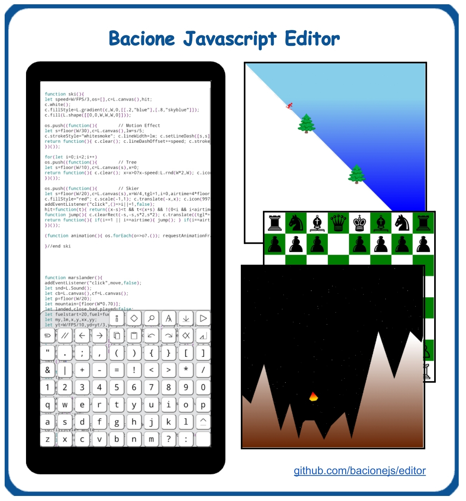

## Brochure

## Links

- [Download](bacione.html) - bacione.html
- [Help.pdf](Help.pdf) - same as help inside the editor
- [Games.pdf](Games.pdf) - tutorial for Ski and Marslander
- [YouTube](http://www.youtube.com/@bacionejs) - product demo
- [Reddit](https://www.reddit.com/r/bacionejs) - post questions

### Why Choose This IDE?

Discover the ultimate free IDE code editor designed specifically for programming small JavaScript games on your phone, even when offline! This phone editor was created because many people don't have a computer, and other phone editors often lack important features. 

Bacione means "big KISS," as in "Keep It Satisfyingly Simple." It offers less clicks compared to other phone editors, with common keys accessible in one click and context-aware logic that reduces the need for repetitive actions. Refactoring code is easier, and you have a fully programmable keyboard where you can create your own icons and functions. Designed for phones and tablets, it requires no setup and operates as a single file that's easy to share. Written in plain vanilla JavaScript with no dependencies, it's free (GPL license), contains no ads, and runs directly from your Android file manager in the Chrome browser. The editor itself is only 7 kilobytes (zipped), making it easy to modify and customize right within the editor. Plus, it supports swipe and long press-repeat for enhanced usability.

## Features

- Less clicks compared to other phone editors.
- Common keys are one click.
- Context aware logic reduces clicks.
- Less work to refactor your code.
- Fully programmable keyboard.
- Create your own keyboard icons and functions.
- Designed for phones and tablets.
- No setup required.
- One file.
- Easy to share.
- Offline.
- Plain vanilla JavaScript.
- No dependencies.
- Free (GPL license)
- No ads
- Run from Android file manager in Chrome browser.
- Easy to modify editor.
- Edit the editor in the editor.
- Editor is only 7 kilobytes (zipped).
- Supports swipe and longpress-repeat.
