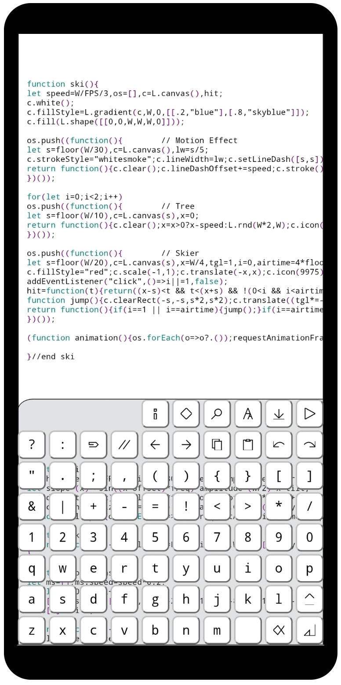

## Brochure

## Install
- Download [bacionejs.html](https://raw.githubusercontent.com/bacionejs/editor/main/bacionejs.html)
- Open your file manager
- Tap `bacionejs.html` to launch in Chrome
- Click `Run` to play the Ski game (runs the game which contains the cursor)

## Links
- [Live Demo](https://bacionejs.github.io/editor/bacionejs.html) - Run from GitHub
- [YouTube](http://www.youtube.com/@bacionejs) - Product demos
- [Games.pdf](Games.pdf) - Tutorials for Ski and Marslander
- [GitHub Discussions](https://github.com/bacionejs/editor/discussions)

## Bacione?
Bacione means big KISS as in Keep It Satisfyingly Simple.

## Purpose
Programming small JavaScript games on a phone offline

## Mission
Create the most thumb-friendly IDE in its class

## Unique
As of March 2025, BacioneJS stands alone as the [only](//github.com/search?q=serverless+javascript+ide+language%3Ahtml&type=repositories) serverless JavaScript IDE built entirely in JavaScript and the [only](//github.com/search?q=ide+%22custom+keyboard%22&type=repositories)
IDE with a fully custom keyboard. These features simplify installation, enable rapid enhancements and reduce editing frustrating.

## Features
1. **Serverless**: No backend needed  
1. **Pure JS**: No dependencies, vanilla JavaScript  
1. **Keyboard**: One-tap common keys  
1. **Run**: Instant code execution  
1. **Save**: Generates a new timestamped file  
1. **Export**: Removes editor  
1. **Editing**: Cut, copy, paste, undo, redo  
1. **Code Assistance**: Auto-complete, auto-indent, auto-comment  
1. **Rename**: Highlights matches as you type  
1. **Superstar**: Highlights all instances of the current word  
1. **Debugging**: Displays message and positions the cursor at the issue  
1. **Diff**: Changes since open/save  
1. **Themes**: Light and dark mode syntax highlighting  
1. **Zoom**: Adjust text size  
1. **Fullscreen**: Expand your workspace  
1. **Gestures**: Swipe and long-press-repeat support  
1. **Pickers**: Icon and color selectors  
1. **Help**: Built-in guide  
1. **Examples**: Games included  
1. **Efficiency**: Fewer clicks than competing editors  
1. **Design**: Optimized for phones and tablets  
1. **Setup**: None—just one file  
1. **Sharing**: Easy to send  
1. **Offline**: No internet required  
1. **Compatibility**: Runs from Android file manager in Chrome  
1. **Free**: GPL licensed, ad-free  
1. **Lightweight**: Just 7 KB  
1. **Self-Editable**: Modify the editor within itself

## Help
- **Swipe**: Swipe up on a key for alternate functions:  
  - Save → Diff  
  - Zoom → Fullscreen  
  - Rename → Superstar Highlight  
  - Misc → Themes  
  - Characters → Shift-like behavior  
- **Editing**: Copy button selects. Backspace cuts. Enter cancels. Repeat to extend or use arrows. See a demo on [YouTube](http://www.youtube.com/@bacionejs).  
- **Paste Buffer**: The Comment button and the Pickers use the Paste buffer.  
- **Closing Views**: Tap anywhere to dismiss views  

## Limitations
- **Compatibility**: Requires Chrome on phones or tablets. Exported games have no such restriction.
- **Single-File**: Android’s file manager limits Chrome to a single HTML file, excluding external assets like images or audio. Use programmatic alternatives (e.g., vector graphics, emojis, noise generators) as seen in Marslander.
- **Alternative**: For complex needs, try [Neovim with Termux and Apache](https://github.com/bacionejs/termux).
