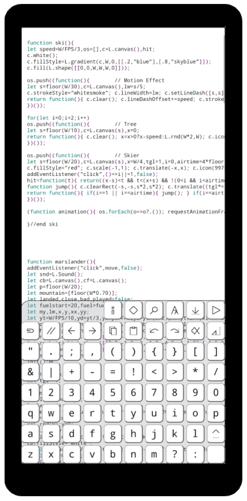

## Demo

## Purpose
Designed for those who don't have a computer but have a smartphone [^1] and would like to experiment with programming, BacioneJS is the most [thumb-friendly](https://youtu.be/lx6Pf-KflcQ?si=jBlJVh4iwFUp_Nj8) IDE for coding small JavaScript games on a phone offline; the only IDE with a fully [custom keyboard](//github.com/search?q=ide+%22custom+keyboard%22&type=repositories) and the only IDE implemented in [standalone JavaScript](//github.com/search?q=standalone+javascript+ide+language%3Ahtml&type=repositories). These innovations reduce editing frustration, simplify installation, and enable rapid enhancements. 

## Installation
- Download [bacionejs.html](https://raw.githubusercontent.com/bacionejs/editor/main/bacionejs.html)
- Open your file manager
- Tap `bacionejs.html` to launch in Chrome
- Click `Run` to play the game which contains the cursor

## Features
1. **Run**: Instant code execution  
1. **Save**: Generates a new timestamped file  
1. **Editing**: Cut, copy, paste, undo, redo  
1. **Code Assistance**: Auto-complete, auto-indent, auto-comment  
1. **Rename**: Find/Replace
1. **Themes**: Light and dark mode syntax highlighting  
1. **Highlight**: Highlights all instances of the current word  
1. **Debugging**: Displays message and positions the cursor at the error  
1. **Diff**: Changes since open/save  
1. **Zoom**: Adjust text size  
1. **Fullscreen**: Expand your workspace  
1. **Gestures**: Swipe and long-press-repeat support  
1. **Pickers**: Icon and color selectors  
1. **Configurable**: Modify the editor source within itself  
1. **Examples**: Games included
1. **Help**: Built-in guide
   
## Limitations
- **Security**: Chrome cannot access local resources. Instead, use programmatic graphics and sound.
- **Alternative**: For complex needs, try [Neovim with Termux and Apache](https://github.com/bacionejs/termux).

[^1]: 80% of families in The Philippines don't have a computer but have a smartphone.
